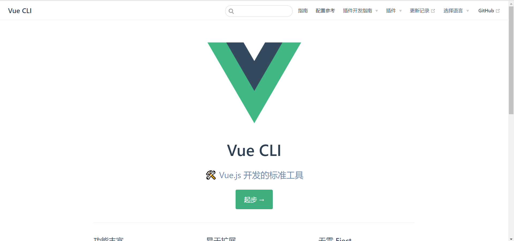
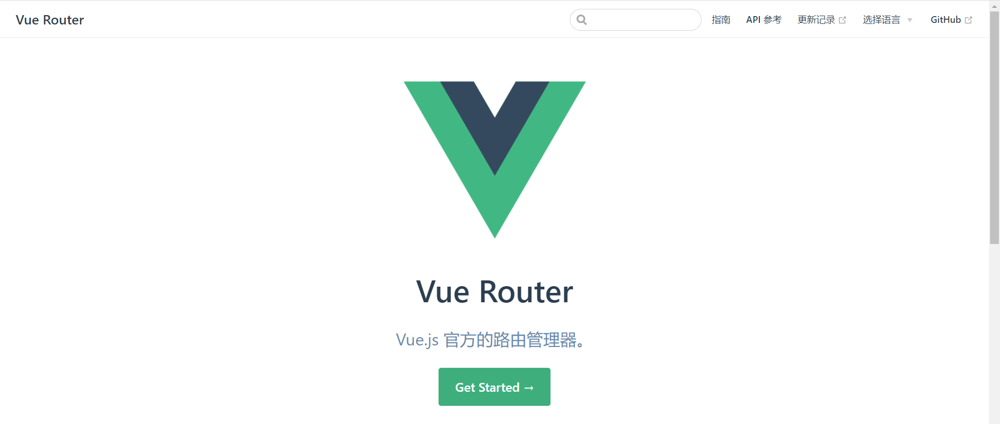
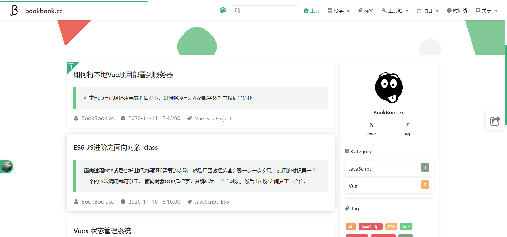
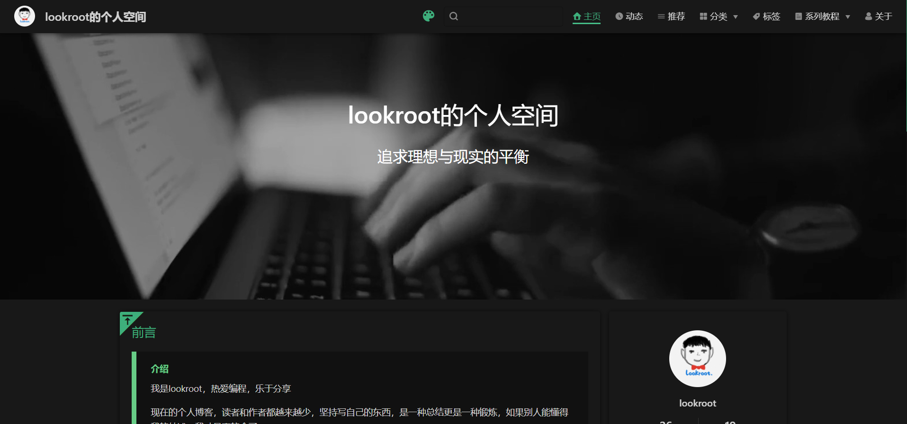

:::tip
如何搭建一个和博主一样的博客网站？请看这里
:::

<!-- more -->

## 一、介绍
首先，我需要告诉你的是，其实搭建一个这样的博客网站，本身并不复杂，甚至可以说简单(当然，在你不自主开发主题的情况下)，你只需要了解 Js+Vue+VuePress即可。

## 二、VuePress
本博客是基于尤大大(尤雨溪)开发的 一款免费开源的 极简网站生成器 [VuePress](https://vuepress.vuejs.org/zh/guide/) + [vuepress-theme-reco](https://vuepress-reco-doc.now.sh/) 主题 构建而成，如果你还不知道 VuePress 是什么东西，那么我推荐你去 Bilibili看一下这两个视频。
1. bilibili [一步步搭建 VuePress 及优化](https://www.bilibili.com/video/BV1vb411m7NY?from=search&seid=12895446522739007147)
2. bilibili [1小时带你搭建vuepress高大上个人博客（极速上手版）](https://www.bilibili.com/video/BV17t41177cr?from=search&seid=12895446522739007147)

## 三、VuePress-theme-reco

当你看完以上两个视频过后，你会发现你搭建的博客是类似 **Vue** 官网风格的，例如：

但是你看见的大多数个人博客并不是那些风格，例如：

此时 你需要了解 [VuePress-theme-reco](https://vuepress-reco-doc.now.sh/),这是一位大佬开源的一款 VuePress 主题。使用它你就能使用极少的配置搭建一款不错的个人博客。

